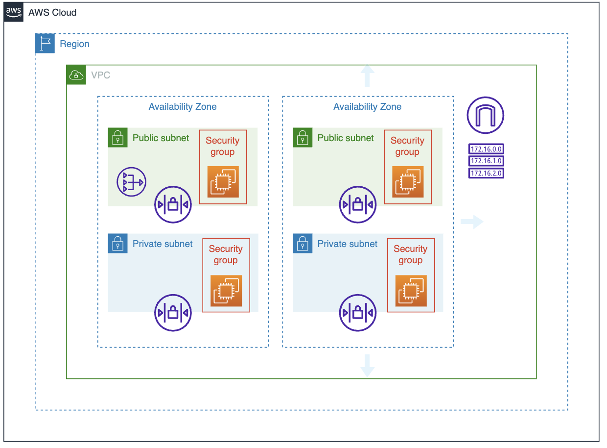

# Step to create AWS Cloud Infrastructure by CDK Typescript
By following this manual we will use cfn* that mean we manually setting everything up by using AWS CloudFormation.

## Table of Contents
- [How to use](#how-to-use)
- [Prerequisites](#prerequisites)
- [Diagram](#diagram)
- [Step 1: Create a new project](#step-1-create-a-new-project)
- [Step 2: Create a new VPC](#step-2-create-a-new-vpc)
- [Step 3: Create subnets](#step-3-create-subnets)
- [Step 4: Create Route Tables](#step-4-create-route-tables)
- [Step 5: Create NAT Gateway](#step-5-create-nat-gateway)
- [Step 6: Create EC2 Instance](#step-6-create-ec2-instance)
- [Step 7 (Bonus): Create makefile](#step-7-bonus-create-makefile)

## How to use
- Clone this repository
```bash
git clone
```
- Install dependencies
```bash
npm install
```
- Deploy the stack
```bash
make deploy
```
- Destroy the stack
```bash
make destroy
```


## Prerequisites
- AWS CLI - [Install AWS CLI](https://docs.aws.amazon.com/cli/latest/userguide/cli-chap-install.html)
- AWS CDK - [Install AWS CDK](https://docs.aws.amazon.com/cdk/latest/guide/getting_started.html)
- NodeJS - [Install NodeJS](https://nodejs.org/en/download/)
- Typescript - [Install Typescript](https://www.typescriptlang.org/download)
- IDE (Visual Studio Code) - [Install Visual Studio Code](https://code.visualstudio.com/download)

## Diagram


### It contains:
- VPC in ap-southeast-1 (Singpopore) region
- 2 Availability Zones (AZ) that in ap-southeast-a and ap-southeast-b
- 2 Public Subnets that in ap-southeast-a and ap-southeast-b
- 2 Private Subnets that in ap-southeast-a and ap-southeast-b
- 1 NAT Gateway in ap-southeast-a
- 1 Internet Gateway
- 1 Route Table for Public Subnets
- 1 Route Table for Private Subnets


## Step 0: Overview
Here is the overview of the code that we will create:
- Create VPC
- Create Internet Gateway
- Attach Internet Gateway to VPC
- Export VPC ID and IGW ID
- Create Subnets Public-1A, Public-1B, Private-1A, Private-1B
- Export Subnet IDs
- Create Public Route Table
- Create Public Route
- Associate Public Subnet 1A with Public Route Table
- Associate Public Subnet 1B with Public Route Table
- Create EIP for NAT Gateway
- Create NAT Gateway
- Create Private Route Table
- Create Private Route
- Associate Private Subnet 1A with Private Route Table
- Associate Private Subnet 1B with Private Route Table
- Create Key Pair
- Create Public Security Group
- Create Private Security Group
- Create EC2 Instance for Public Subnet 1A
- Create EC2 Instance for Private Subnet 1A


## Step 1: Create a new project
```bash
mkdir [PROJECT_NAME] && cd [PROJECT_NAME]
cdk init app --language typescript
```

- [PROJECT_NAME] is the name of your project
- --language typescript is the language that you want to use
- when init it will auto install the dependencies for you

## Step 2: Create a new VPC
- When we create a new project let remove a file that we don't need (That are default file in lib folder).
- Let create a new file in lib folder and name it as cfn-vpc-stack.ts and here is the code:
```typescript
import * as ec2 from "aws-cdk-lib/aws-ec2";
import * as cdk from "aws-cdk-lib";

export class CfnVpcStack extends cdk.Stack {
  constructor(scope: cdk.App, id: string, props?: cdk.StackProps) {
    super(scope, id, props);
    // This library is used to create VPC and Internet Gateway

    // Variables
    const vpcCidr = "10.0.0.0/16";

    // Create VPC
    const vpc = new ec2.CfnVPC(this, "Creating VPC from CfnVPC", {
      cidrBlock: vpcCidr,
      tags: [{ key: "Name", value: "CFN_VPC" }],
    });

    // Create Internet Gateway
    const igw = new ec2.CfnInternetGateway(this, "Creating Interet Gateway", {
      tags: [{ key: "Name", value: "cdk-ts-igw" }],
    });

    // Attach Internet Gateway to VPC
    const vpcigw = new ec2.CfnVPCGatewayAttachment(
      this,
      "Attaching Internet Gateway to VPC",
      {
        vpcId: vpc.ref,
        internetGatewayId: igw.ref,
      }
    );

    // Export VPC ID
    new cdk.CfnOutput(this, "VPCID", {
      value: vpc.ref,
      exportName: "VPCID",
    });

    // Export IGW ID
    new cdk.CfnOutput(this, "IGWID", {
      value: igw.ref,
      exportName: "IGWID",
    });
  }
}
```
Here is the explanation of the code:
- We import the library that we need to create VPC and Internet Gateway
```typescript
import * as ec2 from "aws-cdk-lib/aws-ec2";
import * as cdk from "aws-cdk-lib";
```

- We Create the cidr variable that we will use to create VPC (to make it easy to change)
```typescript
    // Variables
    const vpcCidr = "10.0.0.0/16";
```

- We create VPC by using CfnVPC
```typescript
    // Create VPC
    const vpc = new ec2.CfnVPC(this, "Creating VPC from CfnVPC", {
      cidrBlock: vpcCidr,
      tags: [{ key: "Name", value: "CFN_VPC" }],
    });
```
- We create Internet Gateway by using CfnInternetGateway
```typescript
    // Create Internet Gateway
    const igw = new ec2.CfnInternetGateway(this, "Creating Interet Gateway", {
      tags: [{ key: "Name", value: "cdk-ts-igw" }],
    });
```

- We attach Internet Gateway to VPC by using CfnVPCGatewayAttachment
```typescript
    // Attach Internet Gateway to VPC
    const vpcigw = new ec2.CfnVPCGatewayAttachment(
      this,
      "Attaching Internet Gateway to VPC",
      {
        vpcId: vpc.ref,
        internetGatewayId: igw.ref,
      }
    );
```

- We export VPC ID and IGW ID so we can use it in other stacks
```typescript
    // Export VPC ID
    new cdk.CfnOutput(this, "VPCID", {
      value: vpc.ref,
      exportName: "VPCID",
    });

    // Export IGW ID
    new cdk.CfnOutput(this, "IGWID", {
      value: igw.ref,
      exportName: "IGWID",
    });
```

## Step 3: Create subnets
- Let create a new file in lib folder and name it as cfn-subnet-stack.ts and here is the code:
```typescript
import * as ec2 from "aws-cdk-lib/aws-ec2";
import * as cdk from "aws-cdk-lib";

export class CfnSubnetStack extends cdk.Stack {
  constructor(scope: cdk.App, id: string, props?: cdk.StackProps) {
    super(scope, id, props);
    // This library is used to create Subnet

    // Cidr Blocks
    const public_1a_cidr = "10.0.0.0/18";
    const public_1b_cidr = "10.0.64.0/18";
    const private_1a_cidr = "10.0.128.0/18";
    const private_1b_cidr = "10.0.192.0/18";

    // Availability Zones
    const availabilityZones = ["ap-southeast-1a", "ap-southeast-1b"];

    // Subnets

    // Public-1A
    const public_1a = new ec2.CfnSubnet(this, "Creating Public-1A", {
      cidrBlock: public_1a_cidr,
      vpcId: cdk.Fn.importValue("VPCID"),
      availabilityZone: availabilityZones[0],
      mapPublicIpOnLaunch: true, // This is required to assign public IP to EC2 instance
      tags: [
        { key: "Type", value: "Public" },
        { key: "Name", value: "Public-1A" },
      ],
    });

    // Public-1B
    const public_1b = new ec2.CfnSubnet(this, "Creating Public-1B", {
      cidrBlock: public_1b_cidr,
      vpcId: cdk.Fn.importValue("VPCID"),
      availabilityZone: availabilityZones[1],
      mapPublicIpOnLaunch: true, // This is required to assign public IP to EC2 instance
      tags: [
        { key: "Type", value: "Public" },
        { key: "Name", value: "Public-1B" },
      ],
    });

    // Private-1A
    const private_1a = new ec2.CfnSubnet(this, "Creating Private-1A", {
      cidrBlock: private_1a_cidr,
      vpcId: cdk.Fn.importValue("VPCID"),
      availabilityZone: availabilityZones[0],
      mapPublicIpOnLaunch: false,
      tags: [
        { key: "Type", value: "Private" },
        { key: "Name", value: "Private-1A" },
      ],
    });

    // Private-1B
    const private_1b = new ec2.CfnSubnet(this, "Creating Private-1B", {
      cidrBlock: private_1b_cidr,
      vpcId: cdk.Fn.importValue("VPCID"),
      availabilityZone: availabilityZones[1],
      mapPublicIpOnLaunch: false,
      tags: [
        { key: "Type", value: "Private" },
        { key: "Name", value: "Private-1B" },
      ],
    });

    // Subnets

    // Exporting Subnet IDs

    // Public-1A
    new cdk.CfnOutput(this, "Public-1A-ID", {
      value: public_1a.ref,
      exportName: "Public-1A-ID",
    });

    // Public-1B
    new cdk.CfnOutput(this, "Public-1B-ID", {
      value: public_1b.ref,
      exportName: "Public-1B-ID",
    });

    // Private-1A
    new cdk.CfnOutput(this, "Private-1A-ID", {
      value: private_1a.ref,
      exportName: "Private-1A-ID",
    });

    // Private-1B
    new cdk.CfnOutput(this, "Private-1B-ID", {
      value: private_1b.ref,
      exportName: "Private-1B-ID",
    });
  }
}
```
Here is the explanation of the code:
- We import the library that we need to create Subnet
```typescript
import * as ec2 from "aws-cdk-lib/aws-ec2";
import * as cdk from "aws-cdk-lib";
```
- We create the cidr blocks for each subnet
```typescript
        // Cidr Blocks
    const public_1a_cidr = "10.0.0.0/18";
    const public_1b_cidr = "10.0.64.0/18";
    const private_1a_cidr = "10.0.128.0/18";
    const private_1b_cidr = "10.0.192.0/18";
```
- We create the availability zones for each subnet
```typescript
    // Availability Zones
    const availabilityZones = ["ap-southeast-1a", "ap-southeast-1b"];
```
- We create the subnets
```typescript
    // Subnets

    // Public-1A
    const public_1a = new ec2.CfnSubnet(this, "Creating Public-1A", {
      cidrBlock: public_1a_cidr,
      vpcId: cdk.Fn.importValue("VPCID"),
      availabilityZone: availabilityZones[0],
      mapPublicIpOnLaunch: true, // This is required to assign public IP to EC2 instance
      tags: [
        { key: "Type", value: "Public" },
        { key: "Name", value: "Public-1A" },
      ],
    });

    // Public-1B
    const public_1b = new ec2.CfnSubnet(this, "Creating Public-1B", {
      cidrBlock: public_1b_cidr,
      vpcId: cdk.Fn.importValue("VPCID"),
      availabilityZone: availabilityZones[1],
      mapPublicIpOnLaunch: true, // This is required to assign public IP to EC2 instance
      tags: [
        { key: "Type", value: "Public" },
        { key: "Name", value: "Public-1B" },
      ],
    });

    // Private-1A
    const private_1a = new ec2.CfnSubnet(this, "Creating Private-1A", {
      cidrBlock: private_1a_cidr,
      vpcId: cdk.Fn.importValue("VPCID"),
      availabilityZone: availabilityZones[0],
      mapPublicIpOnLaunch: false,
      tags: [
        { key: "Type", value: "Private" },
        { key: "Name", value: "Private-1A" },
      ],
    });

    // Private-1B
    const private_1b = new ec2.CfnSubnet(this, "Creating Private-1B", {
      cidrBlock: private_1b_cidr,
      vpcId: cdk.Fn.importValue("VPCID"),
      availabilityZone: availabilityZones[1],
      mapPublicIpOnLaunch: false,
      tags: [
        { key: "Type", value: "Private" },
        { key: "Name", value: "Private-1B" },
      ],
    });
```

- We export the subnet IDs so we can use it in other stacks
```typescript
    // Exporting Subnet IDs

    // Public-1A
    new cdk.CfnOutput(this, "Public-1A-ID", {
      value: public_1a.ref,
      exportName: "Public-1A-ID",
    });

    // Public-1B
    new cdk.CfnOutput(this, "Public-1B-ID", {
      value: public_1b.ref,
      exportName: "Public-1B-ID",
    });

    // Private-1A
    new cdk.CfnOutput(this, "Private-1A-ID", {
      value: private_1a.ref,
      exportName: "Private-1A-ID",
    });

    // Private-1B
    new cdk.CfnOutput(this, "Private-1B-ID", {
      value: private_1b.ref,
      exportName: "Private-1B-ID",
    });
```

## Step 4: Create Route Tables
- Let create a new file in lib folder and name it as cfn-route-table-stack.ts and here is the code:
```typescript
import * as ec2 from "aws-cdk-lib/aws-ec2";
import * as cdk from "aws-cdk-lib";

export class CfnPubRtStack extends cdk.Stack {
  constructor(scope: cdk.App, id: string, props?: cdk.StackProps) {
    super(scope, id, props);
    // This library is used to create Route Table

    // Create Public Route Table
    const public_rt = new ec2.CfnRouteTable(this, "Public-RT", {
      vpcId: cdk.Fn.importValue("VPCID"),
      tags: [{ key: "Name", value: "Public-RT" }],
    });

    // Create Public Route
    const public_route = new ec2.CfnRoute(this, "Public-Route", {
      routeTableId: public_rt.ref,
      destinationCidrBlock: "0.0.0.0/0",
      gatewayId: cdk.Fn.importValue("IGWID"),
    });

    // Associate Public Subnet 1A with Public Route Table
    const public_1a_rt_assoc = new ec2.CfnSubnetRouteTableAssociation(
      this,
      "Public-1A-RT-Assoc",
      {
        subnetId: cdk.Fn.importValue("Public-1A-ID"),
        routeTableId: public_rt.ref,
      }
    );

    // Associate Public Subnet 1B with Public Route Table
    const public_1b_rt_assoc = new ec2.CfnSubnetRouteTableAssociation(
      this,
      "Public-1B-RT-Assoc",
      {
        subnetId: cdk.Fn.importValue("Public-1B-ID"),
        routeTableId: public_rt.ref,
      }
    );
  }
}
```

Here is the explanation of the code:
- We import the library that we need to create Route Table
```typescript
import * as ec2 from "aws-cdk-lib/aws-ec2";
import * as cdk from "aws-cdk-lib";
```
- We create the Public Route Table
```typescript
    // Create Public Route Table
    const public_rt = new ec2.CfnRouteTable(this, "Public-RT", {
      vpcId: cdk.Fn.importValue("VPCID"),
      tags: [{ key: "Name", value: "Public-RT" }],
    });
```

- We create the Public Route
```typescript
    // Create Public Route
    const public_route = new ec2.CfnRoute(this, "Public-Route", {
      routeTableId: public_rt.ref,
      destinationCidrBlock: "0.0.0.0/0",
      gatewayId: cdk.Fn.importValue("IGWID"),
    });
```

- We associate the Public Subnet 1A with Public Route Table
```typescript
    // Associate Public Subnet 1A with Public Route Table
    const public_1a_rt_assoc = new ec2.CfnSubnetRouteTableAssociation(
      this,
      "Public-1A-RT-Assoc",
      {
        subnetId: cdk.Fn.importValue("Public-1A-ID"),
        routeTableId: public_rt.ref,
      }
    );
```

- We associate the Public Subnet 1B with Public Route Table
```typescript
    // Associate Public Subnet 1B with Public Route Table
    const public_1b_rt_assoc = new ec2.CfnSubnetRouteTableAssociation(
      this,
      "Public-1B-RT-Assoc",
      {
        subnetId: cdk.Fn.importValue("Public-1B-ID"),
        routeTableId: public_rt.ref,
      }
    );
```

## Step 5: Create NAT Gateway
- Let create a new file in lib folder and name it as cfn-nat-gateway-stack.ts and here is the code:
```typescript
import * as cdk from "aws-cdk-lib";
import * as ec2 from "aws-cdk-lib/aws-ec2";

export class CfnNatStack extends cdk.Stack {
  constructor(scope: cdk.App, id: string, props?: cdk.StackProps) {
    super(scope, id, props);
    // This library is used to create NAT Gateway

    // Create EIP for NAT Gateway
    const eip = new ec2.CfnEIP(this, "Creating EIP for NAT GW", {
      domain: "vpc",
    });

    // Create NAT Gateway
    const natgw = new ec2.CfnNatGateway(this, "Creating NAT Gateway", {
      allocationId: eip.attrAllocationId,
      subnetId: cdk.Fn.importValue("Public-1A-ID"),
    });

    // Create Private Route Table
    const private_rt = new ec2.CfnRouteTable(this, "Creating Private-RT", {
      vpcId: cdk.Fn.importValue("VPCID"),
      tags: [{ key: "Name", value: "Private-RT" }],
    });

    // Create Private Route
    const private_route = new ec2.CfnRoute(this, "Creating Private-Route", {
      routeTableId: private_rt.ref,
      destinationCidrBlock: "0.0.0.0/0",
      natGatewayId: natgw.ref,
    });

    // Associate Private Subnet 1A with Private Route Table
    const private_1a_rt_assoc = new ec2.CfnSubnetRouteTableAssociation(
      this,
      "Private-1A-RT-Assoc",
      {
        subnetId: cdk.Fn.importValue("Private-1A-ID"),
        routeTableId: private_rt.ref,
      }
    );

    // Associate Private Subnet 1B with Private Route Table
    const private_1b_rt_assoc = new ec2.CfnSubnetRouteTableAssociation(
      this,
      "Private-1B-RT-Assoc",
      {
        subnetId: cdk.Fn.importValue("Private-1B-ID"),
        routeTableId: private_rt.ref,
      }
    );
  }
}
```

Here is the explanation of the code:
- We import the library that we need to create NAT Gateway
```typescript
import * as cdk from "aws-cdk-lib";
import * as ec2 from "aws-cdk-lib/aws-ec2";
```
- We create the EIP for NAT Gateway
```typescript
    // Create EIP for NAT Gateway
    const eip = new ec2.CfnEIP(this, "Creating EIP for NAT GW", {
      domain: "vpc",
    });
```
- We create the NAT Gateway
```typescript
    // Create NAT Gateway
    const natgw = new ec2.CfnNatGateway(this, "Creating NAT Gateway", {
      allocationId: eip.attrAllocationId,
      subnetId: cdk.Fn.importValue("Public-1A-ID"),
    });
```

- We create the Private Route Table
```typescript
    // Create Private Route Table
    const private_rt = new ec2.CfnRouteTable(this, "Creating Private-RT", {
      vpcId: cdk.Fn.importValue("VPCID"),
      tags: [{ key: "Name", value: "Private-RT" }],
    });
```
- We create the Private Route
```typescript
    // Create Private Route
    const private_route = new ec2.CfnRoute(this, "Creating Private-Route", {
      routeTableId: private_rt.ref,
      destinationCidrBlock: "0.0.0.0/0",
      natGatewayId: natgw.ref,
    });
```

- We associate the Private Subnet 1A with Private Route Table
```typescript
    // Associate Private Subnet 1A with Private Route Table
    const private_1a_rt_assoc = new ec2.CfnSubnetRouteTableAssociation(
      this,
      "Private-1A-RT-Assoc",
      {
        subnetId: cdk.Fn.importValue("Private-1A-ID"),
        routeTableId: private_rt.ref,
      }
    );
```
- We associate the Private Subnet 1B with Private Route Table
```typescript
    // Associate Private Subnet 1B with Private Route Table
    const private_1b_rt_assoc = new ec2.CfnSubnetRouteTableAssociation(
      this,
      "Private-1B-RT-Assoc",
      {
        subnetId: cdk.Fn.importValue("Private-1B-ID"),
        routeTableId: private_rt.ref,
      }
    );
```

## Step 6: Create EC2 Instance
- Let create a new file in lib folder and name it as cfn-ec2-stack.ts and here is the code:
```typescript
import * as ec2 from "aws-cdk-lib/aws-ec2";
import * as cdk from "aws-cdk-lib";

export class CfnInstanceStack extends cdk.Stack {
  constructor(scope: cdk.App, id: string, props?: cdk.StackProps) {
    super(scope, id, props);
    // This library is used to create EC2 Instance

    // Variables
    const imageId =
      ec2.MachineImage.latestAmazonLinux2023().getImage(this).imageId;
    const instanceType = ec2.InstanceType.of(
      ec2.InstanceClass.T3A,
      ec2.InstanceSize.MICRO
    );

    // Create Key Pair
    const keypair = new ec2.CfnKeyPair(this, "Creating Key Pair", {
        keyName: "cdk-ts-keypair",
    });
      
      
      

    // Create Public Secruity Group for All trafic to EC2 Instance
    const public_sg = new ec2.CfnSecurityGroup(this, "Public-SG", {
      vpcId: cdk.Fn.importValue("VPCID"),
      groupDescription: "Allow all traffic to EC2 Instance",
      securityGroupIngress: [
        {
          cidrIp: "0.0.0.0/0",
          ipProtocol: "tcp",
          fromPort: 0,
          toPort: 65535,
        },
      ],
      tags: [{ key: "Name", value: "Public-SG" }],
    });

    // Create Private Secruity Group for EC2 Instance to access Internet
    const private_sg = new ec2.CfnSecurityGroup(this, "Private-SG", {
      vpcId: cdk.Fn.importValue("VPCID"),
      groupDescription: "Allow all traffic to EC2 Instance",
      securityGroupIngress: [
        {
          cidrIp: "0.0.0.0/0",
          ipProtocol: "tcp",
          fromPort: 0,
          toPort: 65535,
        },
      ],
      tags: [{ key: "Name", value: "Private-SG" }],
    });

    // Create EC2 Instance for Public Subnet 1A
    const public_1a_ec2 = new ec2.CfnInstance(this, "Public-1A-EC2", {
      imageId: imageId,
      instanceType: instanceType.toString(),
      subnetId: cdk.Fn.importValue("Public-1A-ID"),
      keyName: keypair.ref,
      securityGroupIds: [public_sg.ref],

      tags: [
        { key: "Name", value: "Public-1A-EC2" },
        { key: "Type", value: "Public" },
      ],
    });

    // Create EC2 Instance for Private Subnet 1A
    const private_1a_ec2 = new ec2.CfnInstance(this, "Private-1A-EC2", {
      imageId: imageId,
      instanceType: instanceType.toString(),
      subnetId: cdk.Fn.importValue("Private-1A-ID"),
      keyName: keypair.ref,
      securityGroupIds: [private_sg.ref],
      tags: [
        { key: "Name", value: "Private-1A-EC2" },
        { key: "Type", value: "Private" },
      ],
    });
  }
}
```

Here is the explanation of the code:
- We import the library that we need to create EC2 Instance
```typescript
import * as ec2 from "aws-cdk-lib/aws-ec2";
import * as cdk from "aws-cdk-lib";
```
- We create the image ID for EC2 Instance
```typescript
    // Variables
    const imageId =
      ec2.MachineImage.latestAmazonLinux2023().getImage(this).imageId;
    const instanceType = ec2.InstanceType.of(
      ec2.InstanceClass.T3A,
      ec2.InstanceSize.MICRO
    );
```

- We create the Key Pair for EC2 Instance
```typescript
    // Create Key Pair
    const keypair = new ec2.CfnKeyPair(this, "Creating Key Pair", {
        keyName: "cdk-ts-keypair",
    });
```

- We create the Public Security Group for EC2 Instance
```typescript
    // Create Public Secruity Group for All trafic to EC2 Instance
    const public_sg = new ec2.CfnSecurityGroup(this, "Public-SG", {
      vpcId: cdk.Fn.importValue("VPCID"),
      groupDescription: "Allow all traffic to EC2 Instance",
      securityGroupIngress: [
        {
          cidrIp: "0.0.0.0/0",
          ipProtocol: "tcp",
          fromPort: 0,
          toPort: 65535,
        },
      ],
      tags: [{ key: "Name", value: "Public-SG" }],
    });
```

- We create the Private Security Group for EC2 Instance
```typescript
    // Create Private Secruity Group for EC2 Instance to access Internet
    const private_sg = new ec2.CfnSecurityGroup(this, "Private-SG", {
      vpcId: cdk.Fn.importValue("VPCID"),
      groupDescription: "Allow all traffic to EC2 Instance",
      securityGroupIngress: [
        {
          cidrIp: "0.0.0.0/0",
          ipProtocol: "tcp",
          fromPort: 0,
          toPort: 65535,
        },
      ],
      tags: [{ key: "Name", value: "Private-SG" }],
    });
```
- We create the EC2 Instance for Public Subnet 1A
```typescript
    // Create EC2 Instance for Public Subnet 1A
    const public_1a_ec2 = new ec2.CfnInstance(this, "Public-1A-EC2", {
      imageId: imageId,
      instanceType: instanceType.toString(),
      subnetId: cdk.Fn.importValue("Public-1A-ID"),
      keyName: keypair.ref,
      securityGroupIds: [public_sg.ref],

      tags: [
        { key: "Name", value: "Public-1A-EC2" },
        { key: "Type", value: "Public" },
      ],
    });
```
- We create the EC2 Instance for Private Subnet 1A
```typescript
    // Create EC2 Instance for Private Subnet 1A
    const private_1a_ec2 = new ec2.CfnInstance(this, "Private-1A-EC2", {
      imageId: imageId,
      instanceType: instanceType.toString(),
      subnetId: cdk.Fn.importValue("Private-1A-ID"),
      keyName: keypair.ref,
      securityGroupIds: [private_sg.ref],
      tags: [
        { key: "Name", value: "Private-1A-EC2" },
        { key: "Type", value: "Private" },
      ],
    });
```

## Step 7 (Bonus): Create makefile
- Let create a new file in root folder and name it as Makefile and here is the code:
```makefile
# Makefile for AWS CDK project

key-pair-file-name = cdk-ts-keypair
key-pari-id = $(shell aws ec2 describe-key-pairs --key-names ${key-pair-file-name} --query 'KeyPairs[*].KeyPairId' --output text)
public-ip = 18.141.240.204

deploy:

	echo "Creating VPC...🚧"
	npm run cdk deploy CfnVpcStack
	echo "===========> VPC created successfully! 🎉 <===================="

	echo "Creating Subnet...🏖️"
	npm run cdk deploy CfnSubnetStack
	echo "===========> Subnet created successfully! 🎉 <===================="

	echo "Creating Public Route Table...🗺️"
	npm run cdk deploy CfnPubRtStack
	echo "===========> Public Route Table created successfully! 🎉 <===================="

	echo "Creating Nat...🦇"
	npm run cdk deploy CfnNatStack
	echo "===========> Nat created successfully! 🎉 <===================="

	echo "Creating Instance...👨‍💻"
	yes | npm run cdk deploy CfnInstanceStack
	echo "===========> Instance created successfully! 🎉 <===================="

destroy:

	echo "Destroying all Instance...🥹" 
	yes | npm run cdk destroy CfnInstanceStack

	echo "Destroying all Nat...☕️"
	yes | npm run cdk destroy CfnNatStack

	echo "Destroying all Public Route Table...🍵"
	yes | npm run cdk destroy CfnPubRtStack

	echo "Destroying all Subnet...🍺"
	yes | npm run cdk destroy CfnSubnetStack

	echo "Destroying all VPC...🍻"
	yes | npm run cdk destroy CfnVpcStack

ssh-gen:
	aws ssm get-parameter --name /ec2/keypair/${key-pari-id} --with-decryption --query Parameter.Value --output text > key-pair.pem
	chmod 400 key-pair.pem

ssh:
	ssh -i key-pair.pem ec2-user@${public-ip}
```

That's it! Now you can use make deploy to deploy the stack and make destroy to destroy the stack.
Happy coding! 🎉🎉🎉


